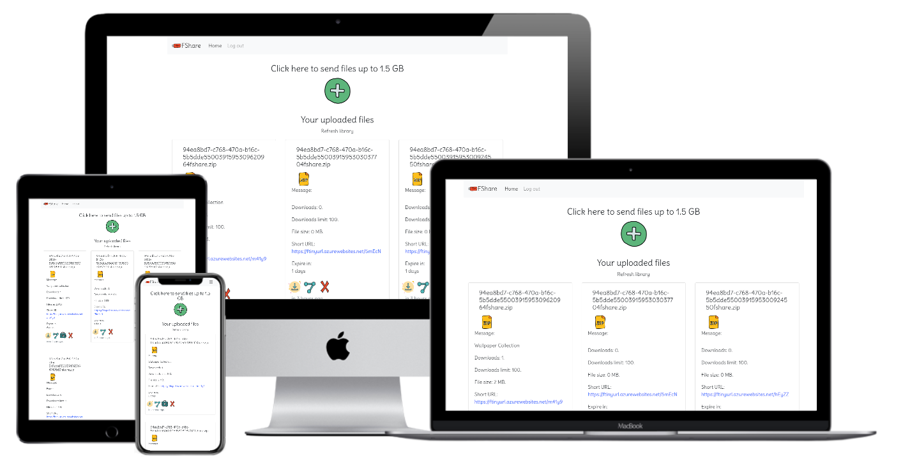

# FShare
FShare - Made Simple, Secure File Sharing on the Web.

A file-sharing service that allows users to safely and simply share files. Users can upload up to 1.5GB file. Users have options like setting download limit, password, or days to expire files. Users can easily share short URLs. Files are encrypted and stored in Microsoft Azure Blob Storage. Never let your files stay on the Internet again.

Features:
1. Upload up to 1.5GB files.
2. Upload and share files.
3. File encryption.
4. Set download limits to your files.
5. Set a password for files.
6. Set expires day for your files.
7. Share a short URL.
8. Access from all devices.
9. Clean user interface.

### Access from the web: https://fshare.netlify.app/

## Source code:

- #### [User Client](https://github.com/pprathameshmore/fshare-clients)
- #### [User Authentication Service](https://github.com/pprathameshmore/fshare-auth-backend)
- #### [Files Service](https://github.com/pprathameshmore/fshare-files-backend)
- #### [URL Shortening Service](https://github.com/pprathameshmore/fshare-short-url-backend)

This project build with Node.js, Express.js, PostgreSQL, MongoDB, Redis, Docker, OAuth2, Microsoft Azure, React.js and Bootstrap 4. I build this a project that will help me to understand Microservices practically. although In this project I am not implemented Gateway or Service Registry. I separated each service of the app into individual services like Authentication, File Handling, Short URL services, etc

All feedback and bugs welcomed.